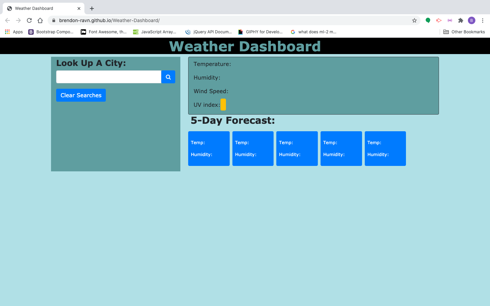
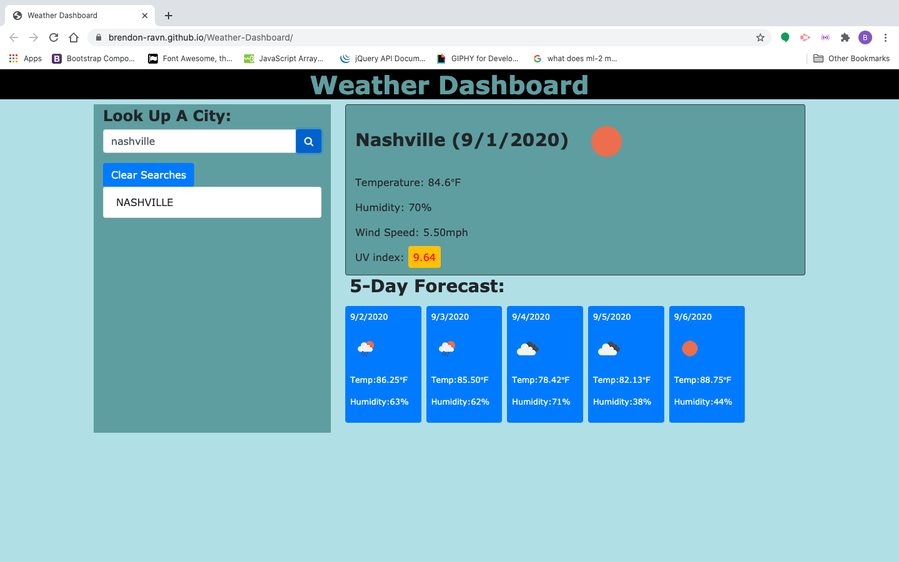

# Weather-Dashboard
This is an app that lets you see the 5-day forecast when you search for a city. 

## Usage
When you type in the name of a town in the the search bar and click the search icon,  there will be a card populated with the current weather along with mini cards   underneath with the next 5 days weather forecasts.

## Installation

Repository- https://github.com/Brendon-Ravn/Weather-Dashboard
 
Website- https://brendon-ravn.github.io/Weather-Dashboard/